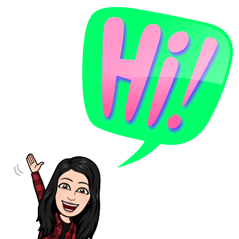
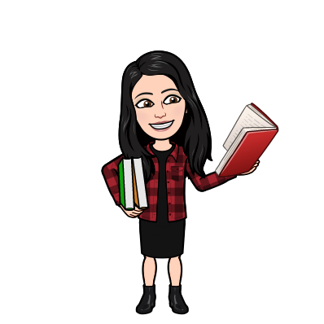
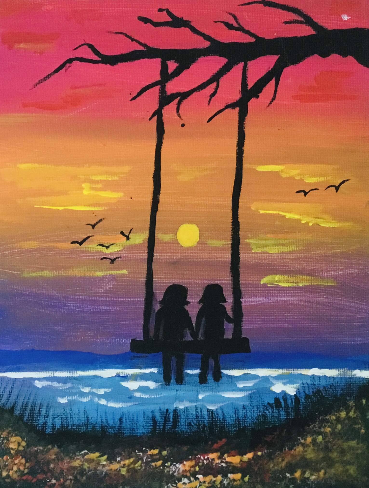
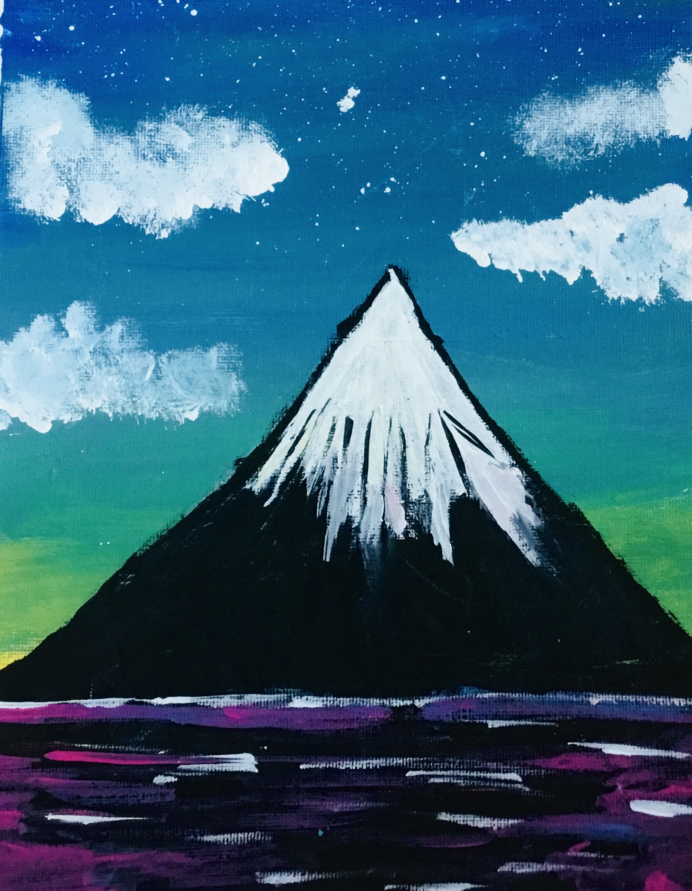

# About Me 

## Who am I?

Hi! I'm Anisha. I'm in fourth grade and I'm 10 years old. I just started code. Here are some programing  and markup languages I've been learning:

> 1. Python

> 2. CSS

> 3. Markdown

## Hobbies
Some of my hobbies are:

- Reading
- Drawing
- Writing
- Painting

Learn about my hobbies in the next section below!

### Drawing 
I love drawing and am a good artist. 
My best drawing is 

I mostly draw realistic animal, and don't do a lot of cartoons.
Also most of my drawing are not colored. To see more of my art go into the art secton. You can search it or
go in to the ART section to find all of my art.
### Reading

Another hobbie of mine is reading!

Here some of the good books I like:

- The Serpents Secret *By Sayanani Dasgupta*
- Guts *By Raina Telginemer*
- Game of the Stars *By Sayanani Dasgupta*
- Mary Anne **likes** Logan *By Ann M. Martin*
- Boy *By Roald Dahl*

### Writing 

I  often draw or read. But sometimes I write. I have started one story, it's called The Monkey's Paw. It's
about a girl named... My bad! I'm spoiling it for you! You can find my stories in the story section. I will
be adding more when I write them

### Painting
Another hobbie is painting. I've made lot's of good paintings. Here are some:  two girls
sitting on a swing in the sunset.  A mountain. 

## Fun Facts
- I'm a good weaver

- I can write with both hands

- 

- 

- 

- 

- 

- 

- 

- 

This is all about me!
